# Tugas-P5-P6
# Dibuat untuk memenuhi tugas B.Pemrograman 

Nama : Andriansyah

Nim  : 312010011

Kelas : TI.20.B1

Praktikum Pertemuan ke 5

input : 

ketika di run maka outputnya seperti ini :

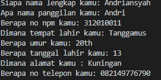

Untuk menampilkan input tadi kita tulis program nya menggunakan perintah print=("")

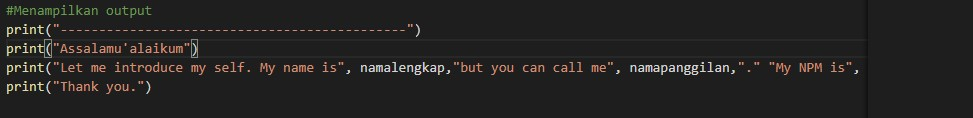
output
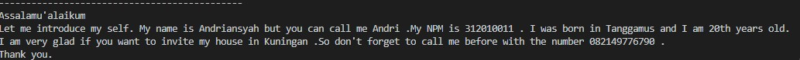

program penggunaan end

input : 

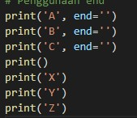

output : 

program separator 

input : 

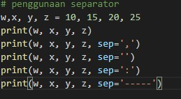

output : 

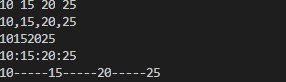

Program penggunaan format string 1

input : 

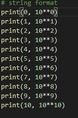

output : 

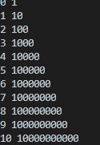

Program penggunaan format string 2

input : 

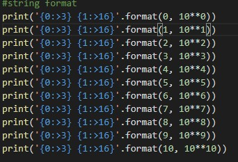

untuk input :'(0:>3) berfungsi mengatur tata letak angka output yg pertama

output : 

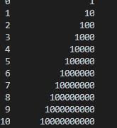

sedangkan output kurung (1:>16) untuk mengatur tata letak pada angka output yg kedua

Penggunaan konversi variable

input : 

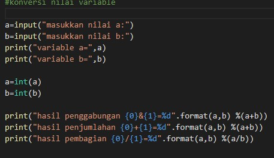

output : 

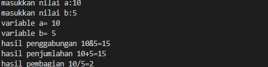

